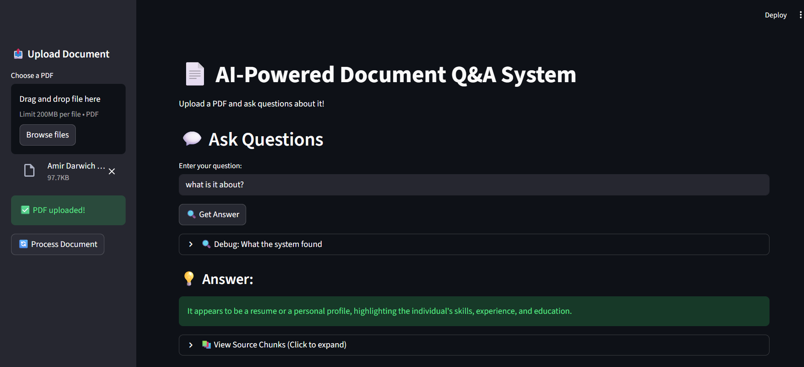

# 📄 AI-Powered Document Q&A System

An intelligent document question-answering system using Retrieval-Augmented Generation (RAG). Upload PDFs and get accurate answers with source citations.


## 🎯 Features

- **PDF Processing**: Automatic text extraction and intelligent chunking
- **Semantic Search**: Vector embeddings for context-aware retrieval
- **AI Responses**: Powered by Groq's Llama 3.3 70B model
- **Source Citations**: View exact document sections used for answers
- **Interactive UI**: Clean Streamlit interface

## 🛠️ Technologies

- **LangChain**: LLM orchestration framework
- **Groq API**: Fast LLM inference (Llama 3.3 70B)
- **Sentence Transformers**: Local embeddings (all-MiniLM-L6-v2)
- **ChromaDB**: Vector database for similarity search
- **Streamlit**: Web application framework
- **PyPDF**: PDF text extraction

## 🏗️ Architecture
```
User Query → Vector Search → Retrieve Relevant Chunks → LLM Generation → Answer + Sources
```

### How RAG Works:
1. **Indexing**: PDFs split into chunks, converted to embeddings, stored in ChromaDB
2. **Retrieval**: User question converted to embedding, similar chunks retrieved
3. **Generation**: LLM receives chunks + question, generates contextualized answer

## 🚀 Installation

### Prerequisites
- Python 3.10+
- Groq API key ([Get free key](https://console.groq.com/))

### Setup

1. Clone repository:
```bash
git clone https://github.com/yourusername/document-qa-system.git
cd document-qa-system
```

2. Create virtual environment:
```bash
python -m venv venv
venv\Scripts\activate  # Windows
source venv/bin/activate  # Mac/Linux
```

3. Install dependencies:
```bash
pip install -r requirements.txt
```

4. Create `.env` file:
```
GROQ_API_KEY=your_groq_api_key_here
```

5. Run application:
```bash
streamlit run app.py
```

## 💡 Usage

1. Open http://localhost:8501
2. Upload a PDF document
3. Click "Process Document"
4. Ask questions in natural language
5. Get AI-generated answers with source citations

### Example Questions:
- "What is the main topic of this document?"
- "Who are the authors?"
- "What are the key findings?"
- "Summarize the methodology"

## 📊 Project Structure
```
document-qa-system/
├── app.py                 # Streamlit UI
├── document_loader.py     # PDF processing & chunking
├── vector_store.py        # Embeddings & vector database
├── requirements.txt       # Dependencies
├── env.example           # Example environment variables
├── .gitignore            # Git ignore rules
└── README.md             # Documentation
```

## 🔮 Future Enhancements

- [ ] Support for multiple file formats (DOCX, TXT, HTML)
- [ ] Multi-document querying
- [ ] Conversation history
- [ ] Answer quality scoring
- [ ] Export Q&A history
- [ ] Different embedding models comparison
- [ ] Fine-tuned models for specific domains

## 🧠 What I Learned

- Implementing RAG (Retrieval-Augmented Generation) systems
- Vector embeddings and semantic search
- LLM prompt engineering for accurate responses
- Chunking strategies for optimal retrieval
- Building production-ready ML applications

## 📝 License

No license specified. This project is shared for educational purposes.

## 🙏 Acknowledgments

- Built as part of ML/AI learning journey
- Inspired by modern document intelligence systems
